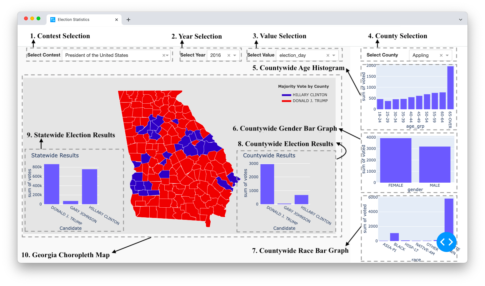

# Georgia Election Map

## About this app

This dashboard allows you to axplore Georgia election results by contest, year, and value. Click on the heatmap to visualize turnout in different counties.

## Requirements

* Python 3

## How to run this app

```
pip install plotly plotly-geo geopandas pyshp shapely dash dash-html-components dash-core-components
python3 app.py

```

Install all required packages by running:
```
pip install -r requirements.txt
```

## Screenshot



## Resources

* [Dash](https://dash.plot.ly/)

